<!-- generated by scripts/readme/build.mjs. do not edit by hand. -->

<picture>
<source media="(max-width: 500px) and (prefers-color-scheme: dark)" srcset="assets/readme/boot-narrow-dark.svg">
<source media="(max-width: 500px)" srcset="assets/readme/boot-narrow-light.svg">
<source media="(prefers-color-scheme: dark)" srcset="assets/readme/boot-dark.svg">

</picture>

A repository starter for **Claude Code and Codex**. Harness Firmware gives both agents versioned instructions, durable project memory, reusable skills, and workflows for testing and independent review.

Keep project decisions and pitfalls with the code. Carry useful lessons into the next session. Review changes before carrying them into another repository.

[Install the skills or start a repository](#quickstart).

## quickstart

Use the **skills-only plugin** for an existing Claude Code repository. Use the **full template** for a new repository or Codex support.

### existing repository · Claude Code plugin

Run these commands inside Claude Code:

```text
/plugin marketplace add ryanportfolio/Harness-Firmware
/plugin install claude-starter@claude-starter
```

Then try `/claude-starter:recall` or `/claude-starter:brainstorming plan the next feature`. Plugin skills use the `claude-starter` namespace.

### new repository · full template

Create a repository with the kernel, hooks, committed memory, skills, and synchronization tools:

- GitHub: select **Use this template**, clone the new repository, then run Claude Code's `/init-project` command or ask Codex to use the `init-project` skill.
- From a cloned Harness Firmware checkout on macOS or Linux: `bash bootstrap/new-claude-project.sh --name my-app --dest ~/code`
- From a cloned checkout on Windows: double-click `bootstrap/New-ClaudeProject.cmd`.

In the created repository, run `node .claude/scripts/doctor.mjs`. Success means the doctor reports no failures. Then ask Claude Code or Codex to use `recall` before the first unfamiliar change.

[Open the complete setup guide](GUIDE.md#full-template) · [View validation runs](https://github.com/ryanportfolio/Harness-Firmware/actions/workflows/validate-template.yml)

## what the firmware adds

| Need | Workflow built into the repository |
| --- | --- |
| Remember the project | `recall` loads relevant committed facts, decisions, and pitfalls before unfamiliar work |
| Finish sustained work | `long-horizon` records progress and evidence across bounded rounds, with fresh audit context |
| Challenge a result | Independent and cross-vendor review skills check work through available agents or authenticated CLIs |
| Verify a claim | `verify-this` separates current checks, comparisons, and causal claims; `perf-loop` measures optimization against a baseline |
| Maintain skills | `addskill` handles creating, importing, updating, and installing skills with the resources each runtime needs |
| Improve the workflow | `refine` captures observed friction; `sync-starter` carries selected generic fixes between repositories |

These are agent instructions and supporting tools. Structural checks validate the package; actual execution still needs the appropriate model, tools, credentials, and evidence.

## the repository feedback loop

<picture>
<source media="(max-width: 500px) and (prefers-color-scheme: dark)" srcset="assets/readme/feedback-narrow-dark.svg">
<source media="(max-width: 500px)" srcset="assets/readme/feedback-narrow-light.svg">
<source media="(prefers-color-scheme: dark)" srcset="assets/readme/feedback-dark.svg">

</picture>

The everyday loop is **recall → work → verify → refine → reviewed repository change → next task**. Project facts load before unfamiliar work. Verification captures evidence. `refine` turns observed friction into a small, reviewable change that strengthens the repository before the next task begins.

The dotted branch is separate: after human review, `sync-starter` can move a generic improvement into the template so future repositories begin with it. Keeping the lesson local remains the default.

## two runtimes, explicit ownership

<picture>
<source media="(max-width: 500px) and (prefers-color-scheme: dark)" srcset="assets/readme/runtime-narrow-dark.svg">
<source media="(max-width: 500px)" srcset="assets/readme/runtime-narrow-light.svg">
<source media="(prefers-color-scheme: dark)" srcset="assets/readme/runtime-dark.svg">

</picture>

**35 Claude Code skills · 34 Codex skills · 20 native Codex workflows · 14 adapters**

- **Claude Code:** reads `CLAUDE.md`, `.claude/skills/`, and hooks for canonical playbooks and Claude-specific startup behavior.
- **Codex:** reads `AGENTS.md` and `.agents/skills/` for standalone Codex workflows and generated adapters with explicit capability and safety boundaries. [Skill ownership and personal copies](docs/codex-skills.md) explains how they are maintained.

Both runtimes read the committed project topics under `.claude/reference/`. Shared workflows live under `.claude/skills/`; standalone Codex workflows live under `.agents/skills/`.

## 35 workflows, loaded when called

**8 core · 12 discipline · 15 specialist**

Only names and routing descriptions sit in the repository's generated skill index. Full workflow bodies stay on demand. The diagram's byte figures are a repository source-file estimate, not total runtime context; [the guide documents the measurement](GUIDE.md#measure-the-always-loaded-layer).

<details>
<summary><strong>Click to open the generated skill memory map</strong></summary>

<picture>
<source media="(max-width: 500px) and (prefers-color-scheme: dark)" srcset="assets/readme/skills-narrow-dark.svg">
<source media="(max-width: 500px)" srcset="assets/readme/skills-narrow-light.svg">
<source media="(prefers-color-scheme: dark)" srcset="assets/readme/skills-dark.svg">

</picture>

</details>

<details>
<summary><strong>Click to browse all 35 skills</strong></summary>

<!-- skill-list:start -->
### core workflows · 8

- [`init-project`](.claude/skills/init-project/SKILL.md) · Configure a starter project when setup is requested, using detected project facts and only necessary user questions.
- [`recall`](.claude/skills/recall/SKILL.md) · Use before unfamiliar project-area work, when retrieving project decisions or pitfalls, when saving an authorized durable fact, or when a quirk just cost a retry, a backed-out change, or a user correction and belongs in pitfalls.
- [`addskill`](.claude/skills/addskill/SKILL.md) · Create, import, update, or install repository or personal skills; includes runtime ownership, resources, and discovery validation.
- [`sync-starter`](.claude/skills/sync-starter/SKILL.md) · Use when the user asks to pull template improvements into a spawned repo, compare starter drift, or push a generic improvement back to the starter.
- [`optimize-context`](.claude/skills/optimize-context/SKILL.md) · Use when the user asks to reduce per-turn context or token load, trim kernels, skills, or connectors, or propagate a generic context optimization to the starter.
- [`refine`](.claude/skills/refine/SKILL.md) · Use for an explicit workflow-improvement review, or recurring task friction that may justify a narrow change to skills or project references.
- [`automate-me`](.claude/skills/automate-me/SKILL.md) · Use for "automate me", "/automate-me", "create/update my -mode skill", or "turn my preferences / working style into a skill". Mines the current project's transcripts plus direct questions, then drafts a personal <handle>-mode skill.
- [`adopt-repo`](.claude/skills/adopt-repo/SKILL.md) · Mirror an existing external repo privately under the user's account and overlay the firmware: clone upstream, strip template-only files, privacy-sweep, run init-project. Use on /adopt-repo <url> or 'pull this repo into our firmware'.

### quality disciplines · 12

- [`brainstorming`](.claude/skills/brainstorming/SKILL.md) · Use when brainstorming or designing a product, interface, workflow, architecture, or behavior change with unresolved goals or material tradeoffs; not for routine or fully specified work.
- [`writing-plans`](.claude/skills/writing-plans/SKILL.md) · Use when a clear task needs a multi-step implementation plan, dependency ordering, or a durable handoff. Skip for routine changes that can be executed directly.
- [`impartial-review`](.claude/skills/impartial-review/SKILL.md) · Use when the user asks to review, audit, or stress-test recent code changes with fresh independent agents; requires exposed multi-agent tools or an authenticated Codex CLI.
- [`perf-loop`](.claude/skills/perf-loop/SKILL.md) · Run measured optimization rounds with independent review for FPS, loading, latency, throughput, and resource use. Use for /perf-loop or broad performance improvement requests; skip routine isolated fixes.
- [`long-horizon`](.claude/skills/long-horizon/SKILL.md) · Use for work too big for one context window: long multi-step tasks, progress lost to compaction or failed retries, work spanning hours or sessions, or when the user says /long-horizon or asks to run a task in verified rounds.
- [`long-horizon-workflows`](.claude/skills/long-horizon-workflows/SKILL.md) · Long-horizon rounds run through the Workflow tool: fresh executor, inspector, and judges per round with schema verdicts and a run journal. Use on /long-horizon-workflows or to run a big task in Workflow-audited rounds. Claude Code only.
- [`babysit-ci`](.claude/skills/babysit-ci/SKILL.md) · Watch a PR's checks and iterate on failures until green. Use for /babysit-ci, "watch CI", "fix CI", "get the checks green", or when a PR is waiting on failing or pending checks.
- [`codex-review`](.claude/skills/codex-review/SKILL.md) · Cross-vendor second-opinion review. Drives OpenAI Codex CLI (codex exec review, gpt-6-sol, high reasoning) over a PR, branch, commit, or uncommitted diff, then verifies each finding. Trigger: /codex-review, "have Codex/Sol review this".
- [`astra-review`](.claude/skills/astra-review/SKILL.md) · Cross-vendor review configured for gpt-6-astra at medium reasoning. Same verified CLI lifecycle as codex-review. Use for /astra-review or 'have Astra review this'.
- [`claude-review`](.claude/skills/claude-review/SKILL.md) · Use when the user says /claude-review, asks Claude or Fable to review code written in Codex, or requests a cross-vendor review through Claude CLI.
- [`verify-this`](.claude/skills/verify-this/SKILL.md) · Verify a claim with fresh local evidence and return VERIFIED, NOT VERIFIED, or INCONCLUSIVE. Use for /verify-this, 'prove it works', 'did this fix it', or 'show me the evidence'.
- [`dare`](.claude/skills/dare/SKILL.md) · Use for /dare, first principles, or questioning the problem: four fresh stages decompose, audit, recombine and test, preserving immutable goals and constraints.

### specialist tools · 15

- [`fable-mode`](.claude/skills/fable-mode/SKILL.md) · Use for difficult multi-step work, uncertain diagnoses, repeated failures, or tasks where verification and handoff need particular care. Skip routine changes.
- [`wow-loop`](.claude/skills/wow-loop/SKILL.md) · Evidence-gated review and repair loop for one deliverable. Use on /wow-loop, requests for wow factor or dial it to 11, or substantial visual work (3D, animation, UI, rendered documents) that needs reference fidelity or repeated visual correction. Skip routine cosmetic edits and discussion of the skill itself.
- [`showpiece`](.claude/skills/showpiece/SKILL.md) · Create distinctive, crafted artifacts in any medium. Use for /showpiece, ambitious creative direction, portfolio-quality work, or substantial cleanup of generic AI styling. Skip routine edits unless explicitly invoked.
- [`arena`](.claude/skills/arena/SKILL.md) · Spawn N parallel candidate attempts at one task, pick the strongest as base, graft the losers' best parts in. Use when the user says /arena, "arena this", or when one attempt at a non-trivial artifact would lock in the wrong shape.
- [`lab`](.claude/skills/lab/SKILL.md) · Use when the user explicitly asks to lab or prototype a visual, UI, motion, or game-feel element with live tuning before production implementation.
- [`advocate`](.claude/skills/advocate/SKILL.md) · Use only when the user explicitly invokes /advocate to challenge a change just made before it lands. Do not trigger from natural-language requests.
- [`why`](.claude/skills/why/SKILL.md) · Use only when the user explicitly invokes /why to challenge the assistant's immediately prior recommendation; never trigger from ordinary why questions or paraphrases.
- [`enhance-prompt`](.claude/skills/enhance-prompt/SKILL.md) · Use when the user asks for a rewritten, copy-ready prompt for another agent or session. Produce the prompt without executing its task.
- [`handoff-audit`](.claude/skills/handoff-audit/SKILL.md) · Draft a self-contained audit prompt for a separate fresh session, with exact scope and falsifiable checks. Does not run the audit.
- [`writing`](.claude/skills/writing/SKILL.md) · Use for text that leaves the session (READMEs, docs, site and UI copy, emails, release notes, application answers) or to unslop, humanize, voice-match, or audit a draft for AI tells. Ordinary session replies use Caveman with built-in Unslop.
- [`forge-repo-ui-skill`](.claude/skills/forge-repo-ui-skill/SKILL.md) · Use when the user wants a repository-specific UI or design skill synthesized from current agent skills; not for ordinary UI implementation or backend-only work.
- [`caveman`](.claude/skills/caveman/SKILL.md) · Use for every session reply to the user: concise Caveman prose with built-in Unslop. User-facing deliverables use Writing instead.
- [`bro`](.claude/skills/bro/SKILL.md) · Restate the assistant's last message in plain human language, no jargon. Use when the user says /bro, "in plain english", "dumb it down", or "what does that actually mean".
- [`session-hub`](.claude/skills/session-hub/SKILL.md) · Coordinate parallel Claude Code sessions via a shared append-only HTML hub. Use on /session-hub, 'run parallel sessions on this', joining a hub, or proactively when edits or commits this session did not make appear in the checkout.
- [`add-source`](.claude/skills/add-source/SKILL.md) · Review an article, paper, report, post or video for SafeAI.watch: trace claims to original sources, verify them, draft record entries, place them on the site, and open a PR. Use for /add-source or 'add this to the site'.
<!-- skill-list:end -->

</details>

## checked on every change

The validation workflow checks shell and PowerShell entry points, generated adapters, native skill propagation, required resources, intended runtime coverage, retired entrypoints, the Windows project generator, and this README's generated facts and assets. [Inspect the CI runs](https://github.com/ryanportfolio/Harness-Firmware/actions/workflows/validate-template.yml).

The [capability manifest](.agents/skill-capabilities.json) records ownership and intended coverage independently of discovery. [Maintenance guidance](docs/codex-skills.md) covers native updates, disabled skills, and personal copies.

Run the local health check:

```bash
node .claude/scripts/doctor.mjs
```

## documentation

- [Setup and operating guide](GUIDE.md)
- [Contribution process](CONTRIBUTING.md)
- [Release history](CHANGELOG.md)
- [Skill provenance](.claude/skills/PROVENANCE.md)
- [MIT license](LICENSE)
