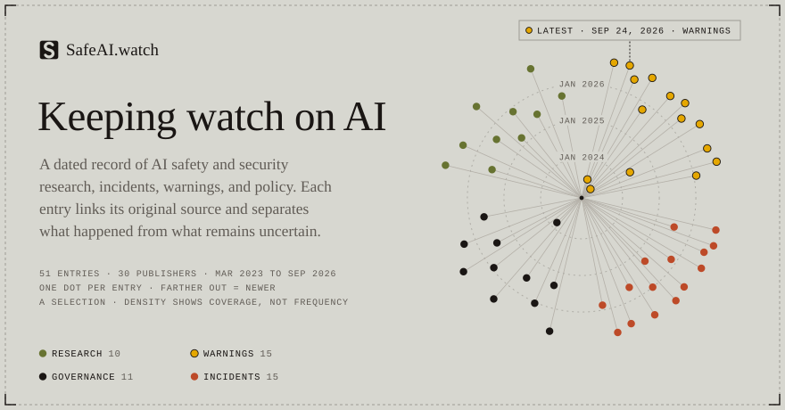

<!-- generated by scripts/readme/build.mjs. do not edit by hand. -->

<a href="https://safeai.watch"><picture>
<source media="(max-width: 500px) and (prefers-color-scheme: dark)" srcset="assets/readme/masthead-narrow-dark.svg">
<source media="(max-width: 500px)" srcset="assets/readme/masthead-narrow-light.svg">
<source media="(prefers-color-scheme: dark)" srcset="assets/readme/masthead-dark.svg">

</picture></a>

**[SafeAI.watch](https://safeai.watch)** is a public record of AI safety and security for general readers: research, reported incidents, public warnings and policy responses. Each entry links its original source and separates what happened from what remains uncertain.

The record holds 51 entries from Mar 22, 2023 to Sep 24, 2026 (15 warnings, 15 incidents, 11 governance, 10 research), drawn from 30 publishers. It is a selection, not a complete count: the burst above shows what the record covers, so its dense rim is no measure of how often such events happen. Read it on the site: [Latest](https://safeai.watch/latest), [Timeline](https://safeai.watch/timeline), [About](https://safeai.watch/about).

## How an entry reads

Every entry keeps four things apart. The newest one, from Sep 24, 2026, filed under Warnings:

> **80,000 Hours publishes an explainer on how AI could cause human extinction**
>
> **What happened.** 80,000 Hours published a video and transcript presented by Luisa Rodriguez, setting out a step-by-step path from today’s AI agent incidents to human extinction or permanent disempowerment.
>
> **Evidence.** An argument, not evidence. It cites real incidents, but the chain it builds from them is the author’s reasoning about what could follow.
>
> **Uncertain.** Rodriguez says she is "not sure which routes are most likely" and would "love for all of it to look silly in hindsight."
>
> **Source.** [80,000 Hours · Explainer video](https://80000hours.org/podcast/episodes/ai-extinction-explained/)

## Run it locally

Needs Node.js 22.12.0 or later.

```bash
npm ci
npm run dev
```

The dev server runs at http://localhost:4321. `npm run build` writes the static site to `dist/`, and `npm run preview` serves that build. The build first runs `npm run film:lint`, which checks the About page film's script against its facts.

## Add or correct an entry

Entries live in [`src/data/events.json`](src/data/events.json). Each one has exactly these keys: `date` (the source's publication date, `YYYY-MM-DD`), `category` (one of `"Warnings"`, `"Incidents"`, `"Governance"`, `"Research"`), `title`, `happened`, `evidence`, `uncertain`, `source` (publisher and source type, such as "RAND · Research report") and `url` (https only). [`src/data/record.ts`](src/data/record.ts) checks every entry when the site builds and fails the build on a missing, empty or extra key, an unknown category, a date not written as `YYYY-MM-DD`, or a link that is not https. Run `npm run build` to check a change; CI runs the same build on every pull request.

The art above is generated from the same file. After changing the record, run `node scripts/readme/build.mjs` and commit `README.md` and `assets/readme/` with it; CI fails while they are out of date. Changes land through pull requests, and a merge to `main` deploys the site.

Spotted an error in an entry? [Open an issue](https://github.com/ryanportfolio/SafeAI.Watch/issues) with the entry's title and a source that shows the correction.

## What the project holds to

- Every entry links its original source.
- Each entry separates what happened, what the evidence shows and what remains uncertain.
- No invented incidents, numbers or quotes. The site's illustrations are conceptual and carry no data; the chart at the top of this README is the exception, drawn from the record.
- No third-party trackers or analytics.

## Layout

| Path | Holds |
|---|---|
| `src/pages/` | The site's pages, built by [Astro](https://astro.build) as static HTML |
| `src/data/` | The record and its build-time checks |
| `src/scripts/visuals/` | The homepage's WebGL visuals |
| `src/scripts/film/`, `film/` | The About page film and its script |
| `scripts/film/` | The film's script check (`npm run film:lint`) and video export |
| `scripts/brand/` | The logo, icons and font subset (`npm run brand`) |
| `scripts/readme/` | This README and its art |

## Licence

Code is under the [MIT licence](LICENSE). Entries summarise and quote their sources; quoted material belongs to its authors. The bundled fonts (Geist, Geist Mono, Newsreader) are under the SIL Open Font License; their texts are in [`LICENSES/`](LICENSES).
